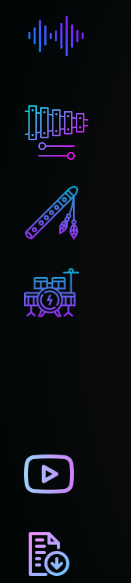
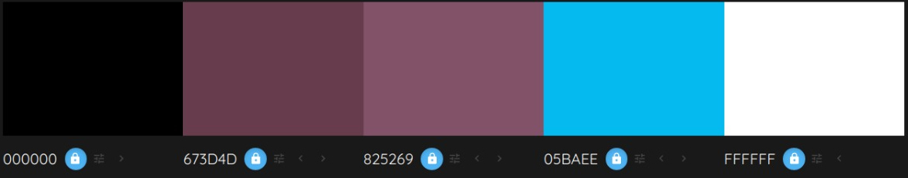
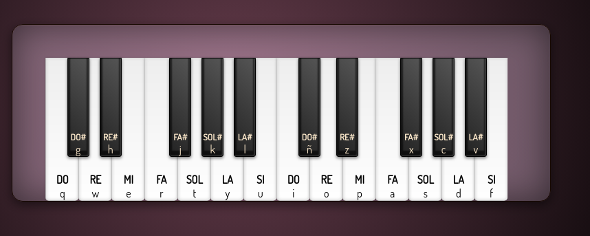
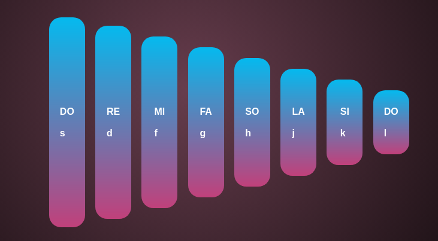
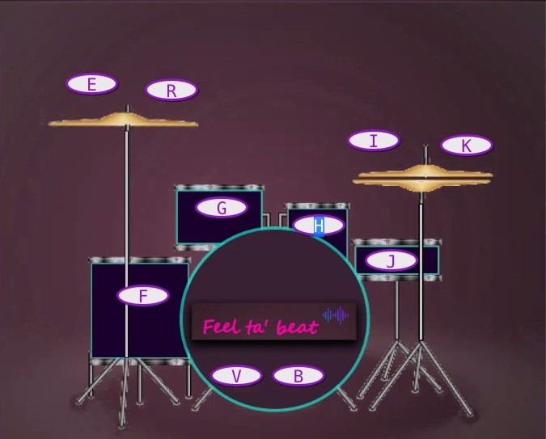

<h1>ESCUELA DE MUSICA EN LINEA</h1>
 
<h2>DESCRIPCIÓN <h2>

Se ha desarrollado una pagina web con instrumentos musicales virtuales que son:

- Piano
- Xilofono
- Flauta
- Bateria

El usuario debe elegir el instrumento en la barra de navegacion para comenzar a tocar. En cada instrumento podra observar las respectivas notas musicales, asi como tambien un video y un documento pdf donde encontrara los primeros pasos para aprender a tocar el instrumento que elija.
En los instrumentos se pueden tocar con el teclado y mause.

<h2> BARRA DE NAVEGACION </h2>

 
<h2> PALETA DE COLORES: <h2>

<h2> INSTRUMENTOS <h2>

 

<h2>LENGUAJES DE PROGRAMACION UTILIZADOS </h2>

- Javascript
- Html
- Css

<h2>INSTRUCCIONES<h2>
Cada Instrumento musical contiene su respectivo html, una hoja de estilos, y un archivo javascript que se encuentran elazados.

 <h3>Xilofono </h3>

- xilofono.html
- xilofostyle.css
- xilofono.js

Para el funcionamiento del proyecto se debe clonar el repositorio.

Para observar el despliegue del proyecto se debera obtener el link de GITHUB.

