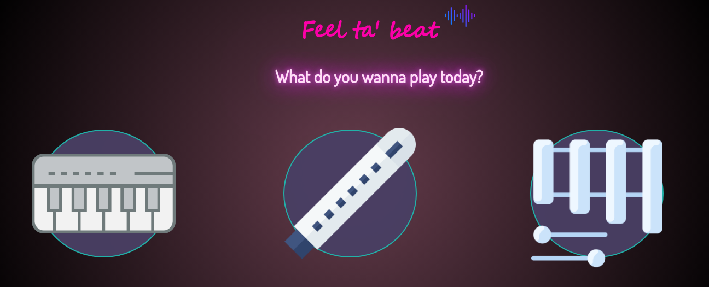
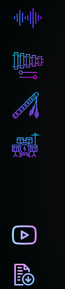
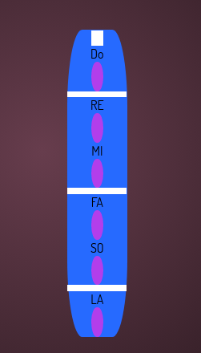

<h1>ESCUELA DE MUSICA EN LINEA</h1>
 

<h2>DESCRIPCIÓN </h2>
Se ha desarrollado una página web con instrumentos musicales virtuales que son:

- Piano
- Xilófono
- Flauta
- Batería

El usuario debe elegir el instrumento en la barra de navegación para comenzar a tocar. En cada instrumento podra observar las respectivas notas musicales, así como también un video y un documento PDF donde encontrara los primeros pasos para aprender a tocar el instrumento que elija.

Los instrumentos se pueden tocar con el teclado y mouse.
Cuando elija tocar  cualquier instrumento con el teclado debe observar las teclas que aparecen en cada nota de cada instrumento para luego presionarlas.

<h2>PANTALLA DE INICIO</h2>

<h2> BARRA DE NAVEGACIÓN </h2>

<h2> BARRA DE NAVEGACIÓN DESPLEGABLE Y ANIMADA</h2>

 
<h2> PALETA DE COLORES: </h2>

<h2> INSTRUMENTOS </h2>
<h3> Piano</h3>
 
<h3> Xilófono</h3>

<h3> Bateria</h3>

<h3>Flauta</h3>

<h2>LA PÁGINA WEB FUE DESARROLLADA CON: </h2>

- Javascript
- Html
- Css

<h2>INSTRUCCIONES</h2>
Cada Instrumento musical contiene su respectivo HTML, una hoja de estilos, y un archivo JAVASCRIPT que se encuentran enlazados.

 <h3>Xilofono </h3>

- xilofono.html
- xilofostyle.css
- xilofono.js

Para el funcionamiento del proyecto se debe clonar el repositorio.

Para observar el despliegue se debera obtener el link de GitHub.

<h2>RECURSOS</h2>

- Figma
- Jira
- Youtube

<h2>AUTORES</h2>

Carolina Loaiza.

Doraly Santander. 

